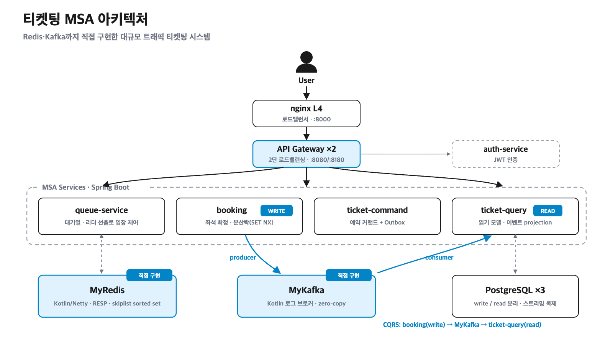

# 🎟️ 티켓팅 MSA — 선착순 예매 시스템

> 고동시성·읽기쓰기 비대칭 도메인을 **MSA + CQRS**로 설계하고,
> **Kafka·Redis를 매니지드에 의존하지 않고 직접 구현(MyKafka·MyRedis)** 해
> "왜 이 구조인가"를 **코드와 부하 측정**으로 검증한 학습 프로젝트.
>
> `2026.05 ~ 진행 중` · Kotlin · Spring Boot · Netty

---

## 한눈에

선착순 예매는 ① 짧은 시간에 트래픽이 폭증하고 ② 읽기(대기 순번 조회)와 쓰기(좌석 확정)의 비대칭이 극단적인 도메인입니다. 이를 해결하기 위해:

- **대기열**로 유입을 완충하고 (queue-service)
- **CQRS**로 읽기 모델과 쓰기 모델을 분리하고
- 그 사이를 **직접 구현한 Kafka(MyKafka)·Redis(MyRedis)** 로 잇고
- **k6 부하테스트로 정합성·성능을 측정**해 설계를 검증했습니다.

---

## ✨ 핵심 포인트

| 영역 | 내용 |
|---|---|
| **★ 직접 구현 인프라** | **MyRedis** — Kotlin/Netty RESP 서버, **skiplist로 ZRANK O(logN)** · **MyKafka** — Kotlin 로그 브로커, 컨슈머그룹·오프셋·zero-copy |
| **CQRS** | `booking`(write) → **MyKafka** `booking-events` → `ticket-query`(read projection), **~400ms eventual consistency** 실측 |
| **대기열 동시성** | queue-service **3대 다중화** + **낙관적 락**(선점 후 초과 롤백) → 정원 초과(oversell) 제거 |
| **2단 로드밸런싱** | nginx **L4**(:8000) + API Gateway **L7**(:8080/:8180) |
| **관측성** | OpenTelemetry로 **카프카를 건너뛰는 e2e 분산추적**(Jaeger), Prometheus/Grafana |

---

## 📊 부하 실측 (로컬)

> **측정 조건**: 로컬 단일 머신 · real Redis 8.6.2 · queue-service **3 인스턴스** · nginx L4 분산 · slot=100 · k6 v2.0.0.
> **추정·보정 없이 실측값만.**

### 동시성 제어 Before / After

3대가 동시에 입장(admit) 처리할 때, 정원(slot 100) 초과 여부:

| 동시성 제어 | 최대 활성 인원 | 결과 |
|---|---|---|
| 없음 (naive) | **193** | **+93명 정원 초과 (oversell)** |
| **낙관적 락 적용** | **100** | **초과 0 (정확)** |

→ 동일 조건에서 동시성 제어만 켜고 끈 결과. **정원 초과 +93 → 0**.

### 단계별 부하 (낙관적 락)

| 부하 (rps) | p50 | p95 | p99 | 에러율 | 정합성 |
|---|---|---|---|---|---|
| 100 | 1.03ms | 2.08ms | 3.15ms | **0%** | ✅ active ≤ slot |
| 500 | 0.42ms | 0.66ms | 0.96ms | **0%** | ✅ active ≤ slot |
| 1,000 | 0.35ms | 0.54ms | 1.07ms | **0%** | ✅ active ≤ slot |

> ⚠️ k6 부하생성기가 서버와 **동일 머신**이라, 위 수치는 처리량 천장이 아닌 관측값입니다. 서버 처리량 한계는 부하생성기 분리 후 재측정 예정입니다. — 상세: [`LOAD_TEST_LOG.md`](https://github.com/Kimseungzzang/ticketing/blob/queue-monitoring/LOAD_TEST_LOG.md)

---

## 🧩 아키텍처 구성

| 계층 | 구성 요소 |
|---|---|
| **Edge / LB** | nginx L4(:8000) → API Gateway ×2 (경로 라우팅 + `lb://` 로드밸런싱) |
| **인증** | auth-service (JWT 발급/검증) |
| **서비스** | `queue-service`(대기열·낙관적 락) · `booking`(좌석 확정, write) · `ticket-command`(Outbox) · `ticket-query`(read model) |
| **자작 인프라** | **MyRedis**(:6379, skiplist) · **MyKafka**(:9092, 로그 브로커) |
| **데이터** | PostgreSQL — write DB / read DB(Primary + Replica 복제) |
| **관측** | OpenTelemetry → Jaeger · Prometheus → Grafana |

**CQRS 이벤트 흐름**: `booking(write)` → `MyKafka[booking-events]` → `ticket-query(read projection)` — 쓰기와 읽기가 서로 모른 채 이벤트로만 이어집니다.

---

## 🛠 기술 스택

`Kotlin` · `Spring Boot` · `Spring Cloud Gateway` · `Netty` · `PostgreSQL` · `Redis` · `nginx` · `k6` · `OpenTelemetry / Jaeger / Grafana` · **`MyKafka / MyRedis (직접 구현)`**

---

## 📂 저장소 구조 (서비스별 브랜치)

| 브랜치 | 내용 |
|---|---|
| [`queue-monitoring`](https://github.com/Kimseungzzang/ticketing/tree/queue-monitoring) | 대기열 서비스 — 낙관적 락·TTL 정리, 부하 실측 `LOAD_TEST_LOG.md` |
| [`ticket-command-service`](https://github.com/Kimseungzzang/ticketing/tree/ticket-command-service) | 예약 커맨드 + Transactional Outbox |
| [`ticket-query-service`](https://github.com/Kimseungzzang/ticketing/tree/ticket-query-service) | 읽기 모델 (CQRS read, booking-events 소비) |
| [`gateway-service`](https://github.com/Kimseungzzang/ticketing/tree/gateway-service) | API Gateway (L7 라우팅 + lb://) |
| [`myRedis`](https://github.com/Kimseungzzang/ticketing/tree/myRedis) | **MyRedis** — skiplist sorted set |
| [`auth-service`](https://github.com/Kimseungzzang/ticketing/tree/auth-service) | 인증 (JWT) |
| [`frontend`](https://github.com/Kimseungzzang/ticketing/tree/frontend) | Next.js 프론트엔드 |
| [`loadtest`](https://github.com/Kimseungzzang/ticketing/tree/loadtest) | k6 부하 시나리오 모음 |

---

## 📌 검증 요약

- ✅ 동시성 제어로 **정원 초과(oversell) +93 → 0**
- ✅ CQRS write→read **이벤트 분리**, ~400ms eventual consistency 실측
- ✅ 대기열 **3대 다중화 정합성**(active ≤ slot) + 이탈 유저 **TTL 자동 회수**
- ✅ 단계별 부하 **에러율 0% · p99 ≤ 3.2ms**
- ✅ MyKafka를 건너뛰는 **e2e 분산추적**(하나의 traceID로 3서비스 관통)
- ⏳ 부하생성기 분리 후 서버 처리량 천장 재측정
